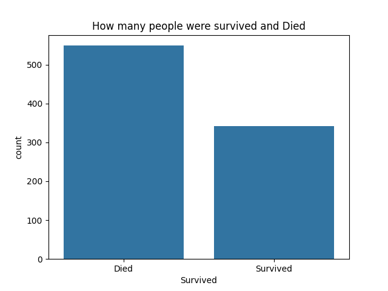
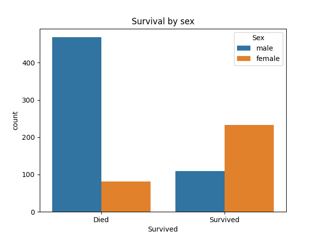
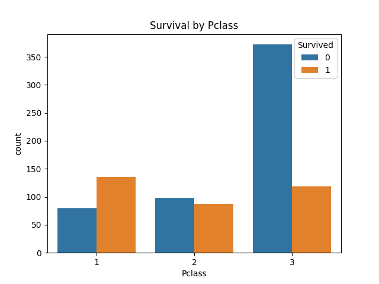
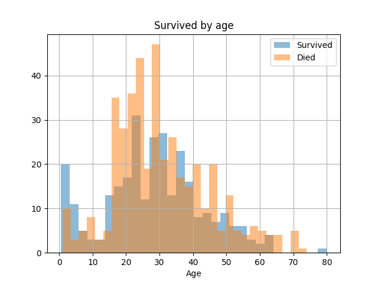
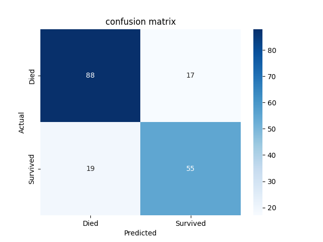

# Titanic Survival Prediction 🚢

## Overview
A Machine Learning model that predicts which passengers survived the Titanic shipwreck.

## Dataset
- 891 passengers
- Source: Kaggle Titanic Dataset

## Steps
1. EDA - Explored survival by sex, class, and age
2. Data Cleaning - Handled missing values
3. Model - Random Forest Classifier
4. Evaluation - 80% accuracy

## Results
| Metric | Score |
|--------|-------|
| Accuracy | 80% |
| Precision | 79% |
| Recall | 79% |
## Results

### Survival Count

### Survival by Sex

### Survival by Class

### Age Distribution

### Confusion Matrix

## Technologies
- Python
- Pandas
- Scikit-learn
- Matplotlib
- Seaborn